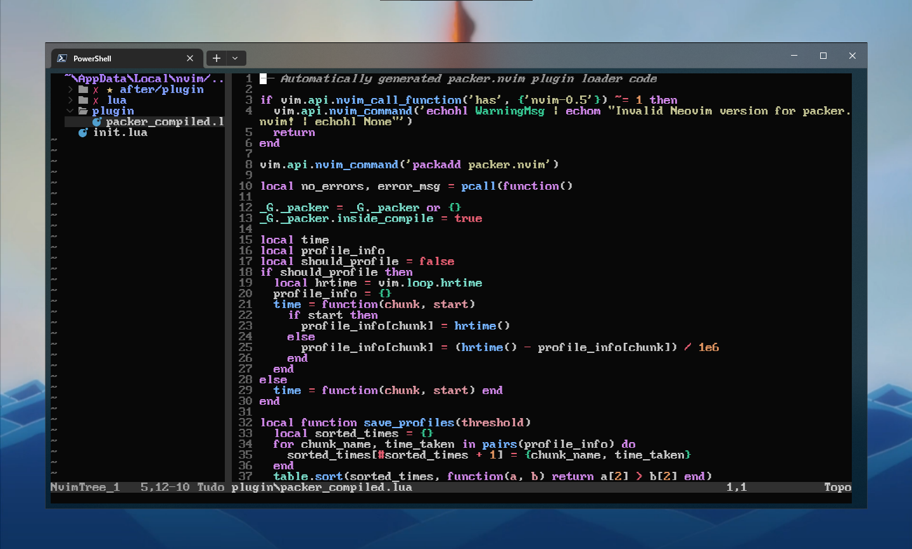

##

### Appearence

  </img>

##
### Plugins installed

-- Packer nvim, A plugin manager for Neovim -> [wbthomason/packer.nvim](https://github.com/wbthomason/packer.nvim)  
-- Moonfly, A dark charcoal theme for modern Neovim and classic Vim -> [bluz71/vim-moonfly-colors](https://github.com/bluz71/vim-moonfly-colors)  
-- Nvim-tree, A File Explorer For Neovim Written In Lua -> [nvim-tree/nvim-tree.lua](https://github.com/nvim-tree/nvim-tree.lua)  
-- Telescope, A Fuzzy Finder for Neovim -> [nvim-telescope/telescope.nvim](https://github.com/nvim-telescope/telescope.nvim)  
-- Treesitter, A configurations and abstraction layer for Neovim -> [nvim-treesitter/nvim-treesitter](https://github.com/nvim-treesitter/nvim-treesitter)

##
